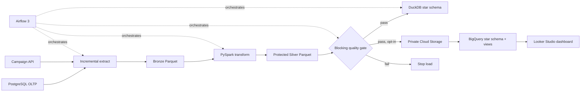

# RetailGuard Data Platform

Privacy-aware batch data platform built as a Road to Data Engineer 3.0 portfolio
project. It demonstrates collection, incremental ingestion, PySpark transformation,
data quality, orchestration, dimensional modelling, BigQuery serving, and Looker
Studio reporting.

## Architecture



Local compute is the default. Google Cloud is limited to Cloud Storage, BigQuery,
and Looker Studio.

## Project Evidence

- Deterministic source data: 100 customers, 50 products, 500 orders, 1,250 order
  items, 500 payments, and 300 campaign events.
- Incremental Bronze extraction with per-source watermarks.
- PySpark Silver transformations with deduplication, typed fields, hashed email,
  masked phone, and removal of raw name, email, address, and phone.
- Blocking checks for required keys, uniqueness, business values, positive amounts,
  referential integrity, payment reconciliation, minimum volume, and raw PII.
- A tracked bad-data fixture proves the gate stops the warehouse load.
- DuckDB and BigQuery star schemas with reconciled facts and dashboard views.
- Airflow 3 DAG with retries, daily scheduling, and task-level observability.
- Idempotency acceptance test proves a second run creates no duplicate facts.

## Live Dashboard

Looker Studio report:
[RetailGuard Executive Dashboard](https://datastudio.google.com/u/5/reporting/8e913aa6-d7c0-4367-991d-c173c8f05abb/page/2pS1F)

Verified view-mode components:

- revenue scorecard: 1,575,759
- orders scorecard: 479
- units scorecard: 3,005
- daily revenue time series by `calendar_date`

## Quick Start

Requirements: Docker Desktop and Docker Compose.

```powershell
Copy-Item .env.example .env
docker compose up -d postgres mock-api
docker compose --profile tools build pipeline
docker compose --profile tools run --rm pipeline demo
```

The `demo` command resets synthetic source data, runs the pipeline twice, checks
warehouse idempotency, and injects the failing quality fixture.

Start Airflow:

```powershell
docker compose --profile airflow up -d airflow
docker compose --profile airflow exec airflow airflow dags list
```

Open [http://localhost:8080](http://localhost:8080). The DAG is
`retailguard_pipeline` and is paused by default on first startup.

## Local Development

Python 3.11 and Java 17 are used for the local PySpark path.

```powershell
python -m venv .venv
.\.venv\Scripts\Activate.ps1
python -m pip install -e ".[dev,spark]"
retailguard --help
retailguard demo
python -m ruff check src tests
python -m pytest
```

## Cloud Publish

Cloud publishing is intentionally excluded from the scheduled Airflow DAG. It is an
explicit operation after the local quality gate passes.

```powershell
gcloud auth login
gcloud auth application-default login
gcloud config set project retailguard-data-platform
gcloud services enable bigquery.googleapis.com storage.googleapis.com

retailguard cloud-plan
retailguard publish-cloud
retailguard cloud-status
```

The publisher:

- creates a private regional bucket with uniform access and public access prevention;
- deletes bucket objects after 30 days;
- uploads only protected Silver Parquet;
- loads six Silver tables with `WRITE_TRUNCATE`;
- creates dimensions, facts, and five Looker-ready views;
- caps each BigQuery query at 100 MiB billed;
- verifies unique sales facts and revenue reconciliation.

## Cost Controls

- Monthly gross-cost budget: THB 90, excluding credits.
- Alert thresholds: 25%, 50%, 75%, 90%, and 100%.
- BigQuery maximum bytes billed per query: 100 MiB.
- No Compute Engine, Cloud SQL, Dataproc, Dataflow, or Cloud Composer.
- Cloud publishing is manual and the data volume is under 100 KiB.
- The billing account must remain in Free Trial and must not be upgraded.

A Google Cloud budget sends alerts; it does not stop resources. See
[Cloud Cost Guardrails](docs/cloud_cost_guardrails.md) for the shutdown procedure.

## Documentation

- [Architecture](docs/architecture.md)
- [Data Dictionary](docs/data_dictionary.md)
- [PII Policy](docs/pii_policy.md)
- [Dashboard Specification](docs/dashboard.md)
- [Operations Runbook](docs/runbook.md)
- [Cloud Cost Guardrails](docs/cloud_cost_guardrails.md)

## Repository Layout

```text
airflow/dags/       Airflow orchestration
docker/             Reproducible service images
quality/fixtures/   Deliberately invalid acceptance data
sql/oltp/           PostgreSQL source schema
src/retailguard/    Pipeline, quality, warehouse, and cloud publisher
tests/              Contract and regression tests
```
