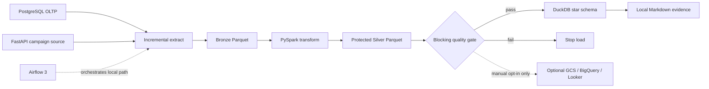

# RetailGuard Data Platform

[](https://github.com/Praciller/retailguard-data-platform/actions/workflows/ci.yml)

A privacy-aware retail data platform that turns deterministic PostgreSQL and
FastAPI sources into incremental Bronze Parquet, protected PySpark Silver data,
blocking quality evidence, and a DuckDB star schema.

The default portfolio review is fully local and requires no cloud account,
billing account, free trial, or hosted service.

## Portfolio Snapshot

| Area | Local evidence |
|---|---|
| Pipeline | PostgreSQL + FastAPI -> Bronze -> PySpark Silver -> quality gate -> DuckDB |
| Privacy | Raw name, email, address, and phone are removed before Silver; email is hashed and phone is masked |
| Quality | Keys, values, relationships, reconciliation, volume, and raw PII are blocking checks |
| Warehouse | DuckDB dimensions, facts, and five serving views |
| Reliability | Watermarks, stable fact keys, two-run idempotency proof, and a deliberately failing fixture |
| Review artifact | Generated Markdown report at `data/evidence/local_portfolio_report.md` |

## Architecture



Default review path:

```text
Synthetic sources -> Bronze -> PySpark Silver -> quality gate
-> DuckDB warehouse/star schema -> local evidence report
```

## Zero-Cost Quickstart

Requirements: Docker Desktop with Docker Compose. `.env` is not required for the
local demo.

```powershell
docker compose up -d postgres mock-api
docker compose --profile tools build pipeline
docker compose --profile tools run --rm pipeline demo
Get-Content .\data\evidence\local_portfolio_report.md
```

`retailguard demo` resets and seeds deterministic sources, runs the local pipeline
twice, verifies warehouse idempotency, proves the bad fixture is blocked, and writes
the reviewer-facing report. It has no cloud call in its execution path.

Expected source volume:

| Dataset | Rows |
|---|---:|
| customers | 100 |
| products | 50 |
| orders | 500 |
| order items | 1,250 |
| payments | 500 |
| campaign events | 300 |

## Review in Under 10 Minutes

1. Run the four quickstart commands.
2. Confirm the demo JSON ends with `"status": "passed"` and includes
   `local_evidence`.
3. Open `data/evidence/local_portfolio_report.md` for KPIs, quality checks,
   privacy controls, reconciliation, idempotency, layer counts, and DuckDB objects.
4. Optionally inspect the warehouse directly:

```powershell
@'
import duckdb
db = "data/warehouse/retailguard.duckdb"
print(duckdb.connect(db, read_only=True).sql("SELECT * FROM vw_daily_sales LIMIT 5"))
'@ | .\.venv\Scripts\python.exe -
```

See [Portfolio Review](docs/portfolio_review.md) and
[Local Demo](docs/local_demo.md) for expected evidence and troubleshooting.

## Local Development

Python 3.11 and Java 17 are used for the local PySpark path.

```powershell
python -m venv .venv
.\.venv\Scripts\Activate.ps1
python -m pip install -e ".[dev,spark]"
retailguard --help
retailguard demo
python -m ruff check src tests
python -m pytest --basetemp=.pytest-tmp
docker compose config --quiet
```

## Airflow

Airflow orchestrates only the local extract, transform, quality, and DuckDB load.
Cloud publication is not part of the DAG.

```powershell
docker compose --profile airflow up -d airflow
docker compose --profile airflow exec airflow airflow dags list
```

Open [http://localhost:8080](http://localhost:8080). The DAG is
`retailguard_pipeline` and is paused on first startup.

## Optional Cloud Publish

The existing GCS, BigQuery, and Looker Studio path remains available as a manual,
opt-in extension. It is not required for portfolio review and may incur cost.
Cloud destination values are blank in `.env.example`; the local demo, Airflow DAG,
and CI never invoke `publish-cloud`.

See [Optional Cloud Publish](docs/cloud_optional.md). Historical cloud/dashboard
evidence remains documented in [Portfolio Evidence](docs/portfolio_evidence.md) and
[Dashboard](docs/dashboard.md).

## Documentation

- [Portfolio Review](docs/portfolio_review.md)
- [Local Demo](docs/local_demo.md)
- [Architecture](docs/architecture.md)
- [Data Dictionary](docs/data_dictionary.md)
- [PII Policy](docs/pii_policy.md)
- [Operations Runbook](docs/runbook.md)
- [Optional Cloud Publish](docs/cloud_optional.md)

## Repository Layout

```text
airflow/dags/       Local Airflow orchestration
docker/             Reproducible local service images
docs/               Reviewer, operations, and optional cloud documentation
quality/fixtures/   Deliberately invalid acceptance data
sql/oltp/           PostgreSQL source schema
src/retailguard/    Pipeline, quality, warehouse, evidence, and optional cloud code
tests/              Contract and regression tests
```
